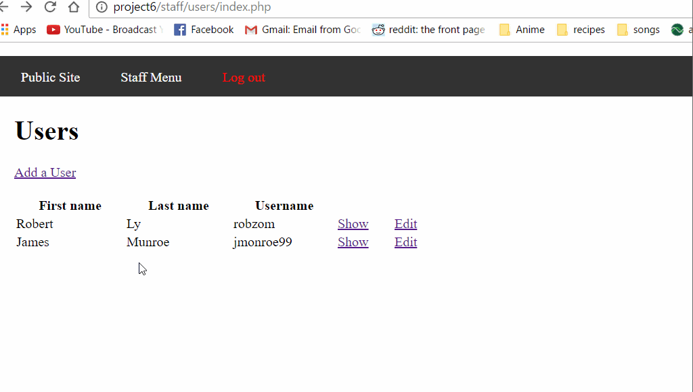

# authenticationLoginThrottling
# Project 10 - Fortress Globitek

Time spent: **2** hours spent in total

> Objective: Create an intentionally vulnerable version of the Globitek application with a secret that can be stolen.

### Requirements

- [X] All source code and assets necessary for running app
- [X] `/globitek.sql` containing all required SQL, including the `secrets` table
- [X] GIF Walkthrough of compromise
- [X] Brief writeup about the vulnerabilities introduced below

### Vulnerabilities

Describe the vuln(s) here.
I've added a sql injection vulnerability in the show users page. The userId GET parameter is used to query the database for a username. Adding a tick at the end of the url will reveal the vulnerability. An attacker can retrieve the secret with a specially crafted url.
